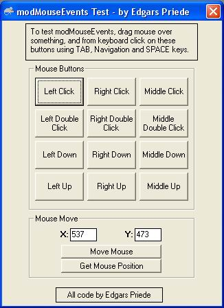



## Mouse Events Simulator \- Module

### Description

With this module you can simulate: Left Button Click, Left Button Double Click, Left Button Down, Left Button Up, Right Button Click, Right Button Double Click, Right Button Down, Right Button Up, Middle Button Click, Middle Button Double Click, Middle Button Down, Middle Button Up, Mouse Move.

Please vote!
 
### More Info
 

             |
---                |---
**Submitted On**   |2005-07-15 04:40:02
**By**             |[Edgars Priede](https://github.com/Planet-Source-Code/PSCIndex/blob/master/ByAuthor/edgars-priede.md)
**Level**          |Advanced
**User Rating**    |4.7 (14 globes from 3 users)
**Compatibility**  |VB 5\.0, VB 6\.0
**Category**       |[Miscellaneous](https://github.com/Planet-Source-Code/PSCIndex/blob/master/ByCategory/miscellaneous__1-1.md)
**World**          |[Visual Basic](https://github.com/Planet-Source-Code/PSCIndex/blob/master/ByWorld/visual-basic.md)
**Archive File**   |[Mouse\_Even1913437152005\.zip](https://github.com/Planet-Source-Code/edgars-priede-mouse-events-simulator-module__1-61703/archive/master.zip)

### API Declarations

View in code...

